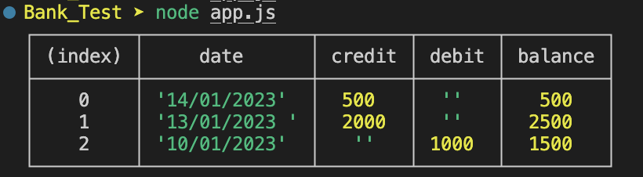

## Problem and Requirements

- You should be able to interact with your code via a REPL like IRB or Node. (You don't need to implement a command line interface that takes input from STDIN.)

- Deposits, withdrawal.

- Account statement (date, amount, balance) printing.

- Data can be kept in memory (it doesn't need to be stored to a database or anything).

## Intsall and run my code

```
Install dependencies: npm install
Run tests: jest
```

## Approach

I created two classes, one to have the bank logic and the other to format the output. I started initially by designing the classes and their methods which can be found in the design.md file.

## Output Screenshot


